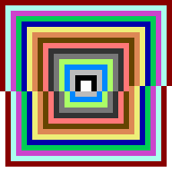
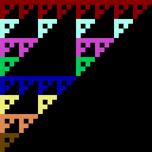

# 6502.NET

[](https://github.com/joeyrobert/6502.NET/actions/workflows/ci.yml)

6502.NET is an emulator for the MOS Technology 6502, the 8-bit microprocessor that powered the Apple II,
Commodore 64, Atari 2600 and NES. It is written in C# for .NET 8 and runs on Windows, Linux and macOS.

It was inspired by [6502asm.com](https://6502asm.com): a 32x32 pixel, 16 colour screen is mapped into memory
at `$0200`, `$FE` returns a random byte and `$FF` holds the last key pressed, so programs written for that
site run unchanged.

## Features

- **Complete opcode coverage**: all 151 documented NMOS 6502 opcodes in every addressing mode, with
  cycle-accurate timing (page-cross and branch penalties), decimal mode (`SED`), correct `BRK`/`RTI`,
  IRQ/NMI/reset, and the well-known quirks (`JMP ($xxFF)` page wrap, zero page wrap-around).
  Undocumented opcodes raise `InvalidOpCodeException`.
- **Verified against Klaus Dormann's functional test suite**, which the test project runs in CI, plus a
  test for each opcode, addressing mode, flag behaviour and example program.
- **A built-in two pass assembler** (labels, constants, `.org`, `.byte`, `.word`, `.text`, `.fill`,
  `<label` / `>label`, simple `+`/`-` expressions) so programs can be written as readable `.asm` files.
- Two front ends: a cross-platform **text display** and a **WinForms graphical display**.

## Visual demos

The 32x32 screen makes for some fun demos. These screenshots were produced with `--headless N --png`
(see below); the animated ones (`tunnel`, `bouncing_ball`, `disco`, `random_dots`) move when run for real.




`tunnel` and `bouncing_ball`, recorded with `--gif` (the occasional tear in `tunnel` is real: the 6502 redraws the
whole screen pixel by pixel, so frames are sometimes caught half-drawn).

| | | |
| --- | --- | --- |
|  |  |  |
| `sierpinski` | `smiley` | `tunnel` (animated) |
|  |  | |
| `gradient` | `disco` (animated) | |

## Getting started

You need the [.NET 8 SDK](https://dotnet.microsoft.com/download).

```sh
dotnet test Emulator.Tests                                         # run the test suite
dotnet run --project Emulator.Display.Text                         # run the default example (disco)
dotnet run --project Emulator.Display.Text -- --list               # list the bundled examples
dotnet run --project Emulator.Display.Text -- primes --headless 20000
dotnet run --project Emulator.Display.Text -- path/to/my_program.asm
```

In a terminal the text display draws true-colour blocks (Windows Terminal, iTerm2, GNOME Terminal and most modern
terminals work); press Ctrl+C to quit. Options: `--mhz X` sets the emulated clock speed (default 4 MHz),
`--no-throttle` runs flat out, and `--letters` draws each pixel as a letter (`a` = colour 0 ... `p` = colour 15).

`--headless N` runs `N` instructions without a display and prints the registers and the screen, which is handy for
scripts and CI. Add `--png screen.png [--scale 8]` to save the final screen as an image, e.g.
`dotnet run --project Emulator.Display.Text -- sierpinski --headless 100000 --png sierpinski.png`.

To record an animated GIF, use `--gif` with `--seconds` (emulated time), `--fps`, `--scale` and `--mhz`:
`dotnet run --project Emulator.Display.Text -- tunnel --gif tunnel.gif --seconds 2 --fps 20 --scale 6`.

On Windows the graphical display shows the real colours:

```sh
dotnet run --project Emulator.Display.Graphics -- gradient
```

## Example programs

All examples live in [`Examples/`](Examples) and are covered by tests.

| Program | What it does |
| --- | --- |
| `disco.asm` | Flashes the screen through all 16 colours |
| `random_dots.asm` | Paints random pixels using the random byte at `$FE` and indirect indexed addressing |
| `sierpinski.asm` | Sierpinski triangle from `x AND y == 0` |
| `smiley.asm` | Draws an 8x8 bitmap scaled 4x with a bit-shifting loop |
| `tunnel.asm` | Animated concentric colour rings using `min()` of four distances |
| `bouncing_ball.asm` | A bouncing pixel: subroutines, signed deltas, collision flips |
| `gradient.asm` | Draws a diagonal colour gradient with nested loops and 16 bit address arithmetic |
| `fibonacci.asm` | Computes the Fibonacci sequence into memory |
| `primes.asm` | Sieve of Eratosthenes for the primes below 128 |
| `bubble_sort.asm` | Bubble sort of 10 bytes, swapping via the stack |
| `multiply.asm` | 8x8 to 16 bit shift-and-add multiply as a subroutine (`JSR`/`RTS`) |
| `bcd_counter.asm` | Counts to 99 in decimal mode |
| `stack_demo.asm` | Subroutines, `PHP`/`PLP`/`PHA`/`PLA` and `JMP (indirect)` |

## Using the library

```csharp
using Emulator.Interpreter;

var program = Assembler.Assemble("""
    lda #$05
    clc
    adc #$03
    sta $10
    brk
    """);

var memory = new Memory();          // 64 KiB
program.Load(memory);

var cpu = new Processor(memory, (ushort)program.Entry);
cpu.Run();                          // runs until BRK (with no IRQ vector installed) halts it

Console.WriteLine(memory.Read(0x10));   // 8
Console.WriteLine(cpu.Cycles);          // 16
```

`Processor.Step()` executes one instruction and returns the cycles it took. `BRK` behaves like real hardware
(pushes state and jumps through the vector at `$FFFE`) unless that vector is zero, in which case it stops the
program, so simple programs can end with `BRK`.

## Layout

| Path | Contents |
| --- | --- |
| `Emulator/` | The library: `Processor`, `Memory`, `Opcodes` table, `Assembler` |
| `Emulator.Display.Text/` | Console front end (`6502net`) |
| `Emulator.Display.Graphics/` | WinForms front end (`6502net-gui`, Windows only) |
| `Emulator.Tests/` | xUnit tests, including the functional test harness |
| `Examples/` | Assembly example programs |

### Functional test

`Emulator.Tests` runs [Klaus Dormann's 6502 functional test](https://github.com/Klaus2m5/6502_65C02_functional_tests)
when `Emulator.Tests/TestData/6502_functional_test.bin` exists (CI downloads it; it is GPL licensed so it is not stored
in this repository). To run it locally:

```sh
mkdir -p Emulator.Tests/TestData
curl -L -o Emulator.Tests/TestData/6502_functional_test.bin \
  https://raw.githubusercontent.com/Klaus2m5/6502_65C02_functional_tests/master/bin_files/6502_functional_test.bin
dotnet test Emulator.Tests
```

## License

Copyright (c) 2009 Joseph Robert. Licensed under the GNU Lesser General Public License v3.0 or later; see [LICENSE](LICENSE).
